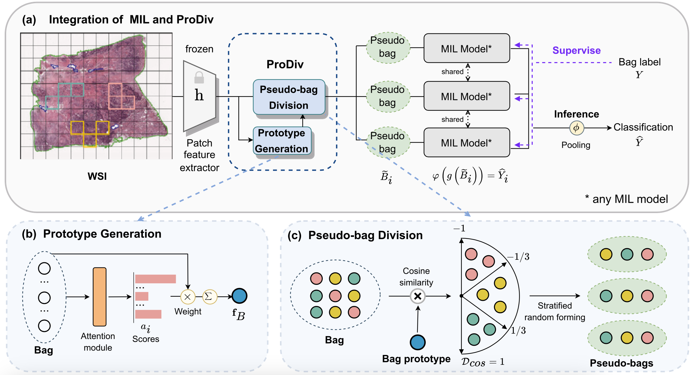

# ProDiv: Prototype-driven consistent pseudo-bag division for whole-slide image classification

*Computer Methods and Programs in Biomedicine, 2024*

[[Journal Link]](https://www.sciencedirect.com/science/article/abs/pii/S0169260724001573) | [[arXiv]](https://arxiv.org/abs/2304.06652) | [[Related Resources]](https://github.com//UESTC-nnLab/ProDiv?tab=readme-ov-file#-related-resources) | [[Citation]](https://github.com//UESTC-nnLab/ProDiv?tab=readme-ov-file#-citation)

***Abstract***: (1) Methods: This scheme first designs an attention-based method to generate a bag prototype for each slide. On this basis, it further groups WSI patch instances into a series of instance clusters according to the feature similarities between the prototype and patches. Finally, pseudo-bags are obtained by randomly combining the non-overlapping patch instances of different instance clusters. Moreover, the design scheme of our ProDiv considers practicality, and it could be smoothly assembled with almost all the MIL-based WSI classification methods in recent years. (2) Conclusions: ProDiv could almost always bring obvious performance improvements to compared MIL models on typical metrics, which suggests the effectiveness of our scheme. Experimental visualization also visually interprets the correctness of the proposed ProDiv.

<!-- Insert a pipeline of your algorithm here if got one -->
<div align="center">
    <a href="https://"></a>
</div>

---

We use the pre-trained ResNet50 for extracting patch features. You can download the pre-trained ResNet50 at [here](https://download.pytorch.org/models/resnet50-19c8e357.pth).

## ProDiv+

An improved version (`ProDiv+`) can be found at [PseMix](https://github.com/liupei101/PseMix/blob/main/utils/core.py#L148). Moreover, ProDiv is also contained. For more details, you can move to the [PseMix repo](https://github.com/liupei101/PseMix). 

## 🔥 Related Resources

Here we list the related works involving **pseudo-bags** or using **pseudo-bags for training deep MIL networks**.

| Model          | Subfield    | Paper             | Code            | Base   |
| :------------- | :---------- | :---------------- | :-------------- | :----- |
| BDOCOX (TMI'21)         | WSI Survival Analysis | [Weakly supervised deep ordinal cox model for survival prediction from wholeslide pathological images](https://ieeexplore.ieee.org/document/9486947) | - | K-means-based pseudo-bag division |
| DTFD-MIL (CVPR'22)      | WSI Classification    | [Dtfd-mil: Double-tier feature distillation multiple instance learning for histopathology whole slide image classification](https://arxiv.org/abs/2203.12081) | [Github](https://github.com/hrzhang1123/DTFD-MIL)            | Random pseudo-bag division   |
| ProDiv (CMPB'24)     | WSI Classification    | [ProDiv: Prototype-driven Consistent Pseudo-bag Division for Whole-slide Image Classification](https://www.sciencedirect.com/science/article/pii/S0169260724001573) | [Github](https://github.com/UESTC-nnLab/ProDiv)            | Prototype-based consistent pseudo-bag division     |
| PseMix (TMI'24)         | WSI Classification   | [Pseudo-Bag Mixup Augmentation for Multiple Instance Learning-Based Whole Slide Image Classification](https://ieeexplore.ieee.org/abstract/document/10385148) | [Github](https://github.com/liupei101/PseMix)                 | Pseudo-bag Mixup  |
| ICMIL (TMI'24)      | WSI classification    | [Rethinking Multiple Instance Learning for Whole Slide Image Classification: A Bag-Level Classifier is a Good Instance-Level Teacher](https://ieeexplore.ieee.org/abstract/document/10538113) | [Github](https://github.com/Dootmaan/ICMIL)           |  Utilizing pseudo-bags in training   |
| PMIL       | WSI classification     | [Shapley Values-enabled Progressive Pseudo Bag Augmentation for Whole Slide Image Classification](https://arxiv.org/abs/2312.05490) | -         |   Progressive pseudo-bag augmentation  |

## 📝 Citation

If you find this work helps your research, please consider citing our paper via
```txt
@article{YANG2024108161,
    author = {Yang, Rui and Liu, Pei and Ji, Luping},
    doi = {https://doi.org/10.1016/j.cmpb.2024.108161},
    issn = {0169-2607},
    journal = {Computer Methods and Programs in Biomedicine},
    pages = {108161},
    title = {{ProDiv: Prototype-driven consistent pseudo-bag division for whole-slide image classification}},
    url = {https://www.sciencedirect.com/science/article/pii/S0169260724001573},
    volume = {249},
    year = {2024}
}
```
